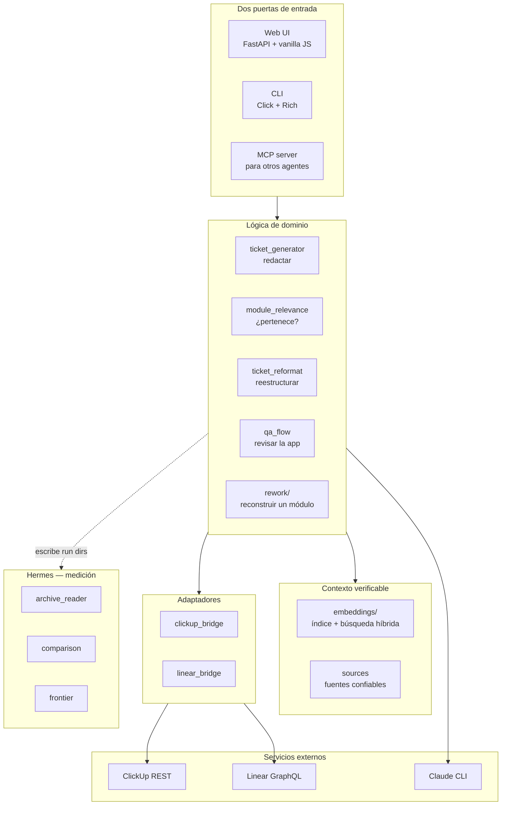

# Cómo funciona el harness

> Documento de referencia: qué hace, con qué está construido, cómo está organizado
> y cómo logra cada cosa. Empieza en lenguaje llano y termina en detalle técnico.

---

## Parte 1 — La versión corta

**El harness escribe y arregla tickets. Hermes lleva el marcador, para que «esta versión
es mejor» sea un dato y no una opinión.**

Los tickets son la materia prima del proyecto. Escribirlos bien es lento, aburrido y cada
persona lo hace distinto. El harness se encarga de esa parte:

| Función | En palabras simples |
|---|---|
| **Generar** | Pegas un documento o simplemente conversas. Redacta tickets en el formato de la casa. |
| **Module check** | «¿Este ticket pertenece al módulo de Requerimientos?» → pertenece / parcialmente / no pertenece |
| **QA review** | Recorre la aplicación, registra qué está roto y levanta hallazgos |
| **Modify** | Toma un ticket mal escrito y lo reestructura — con vista previa, no guarda nada hasta que apruebas |
| **Rework batch** | Reconstruye los tickets de un módulo completo como sub-issues ordenados bajo un padre |

Todo es **preview-first**: te muestra lo que haría, tú apruebas, recién entonces escribe.

### Cómo evita inventar cosas

Esta es la parte que importa. Un agente que inventa datos que suenan plausibles es peor
que inútil.

1. **Apuntas a una fuente confiable.** Una carpeta, un enlace de GitHub, un documento.
   Registrarla toma unos **0.02 segundos**, porque no lee todo de entrada.
2. **Indexa el esqueleto, no el libro completo.** Como una biblioteca donde anotas los
   títulos de capítulo y de sección en lugar de leer cada libro entero: ~15% del texto y
   encuentra lo mismo. El repo `sigo`: **2,788 archivos indexados**.
3. **Busca de dos maneras y las combina.**
   - `calculateInvoiceTotal` → búsqueda exacta (ripgrep): encuentra ese nombre literal
   - «cómo se crean los tickets» → búsqueda por significado (embeddings): encuentra el concepto

   La exacta es mala con conceptos; la semántica es mala con nombres exactos. Juntas se cubren.
4. **Relee el archivo real antes de responder.** El índice es una *copia*, y las copias se
   desactualizan. Cada fragmento citado se verifica contra el archivo en disco en ese momento.
   Si el código se movió, marca `drifted` en lugar de citar algo que ya no existe.

El objetivo no es *«probablemente correcto»* sino *«acá está el archivo y la línea, ve a mirar»*.

---

## Parte 2 — Stack tecnológico

### Backend

| Componente | Tecnología | Por qué |
|---|---|---|
| Lenguaje | Python (≥3.9, corre en 3.14) | Ecosistema de ML y clientes HTTP |
| API web | **FastAPI** + **Uvicorn** | Tipado con Pydantic y OpenAPI automático |
| Validación | **Pydantic** | Los esquemas de request/response son la frontera del sistema |
| CLI | **Click** + **Rich** | Toda función del UI existe también en terminal |
| HTTP | **requests** | Clientes de ClickUp y Linear |
| Concurrencia de archivos | **filelock** | Impide que dos indexados corrompan la misma base |

### Almacenamiento

Sin servidor de base de datos. Todo el estado es local y auditable:

| Archivo | Qué guarda |
|---|---|
| `qa/embeddings.db` | SQLite: fuentes, archivos indexados, chunks y vectores (BLOB float32) |
| `qa/findings.db` | SQLite: hallazgos de QA |
| `qa/project_config.json` | Configuración por proyecto |
| `qa/reformat_history.json` | Versión previa de cada ticket reformateado (para revertir) |
| `qa/rework_history.json` | Últimas 20 corridas de rework (para deshacer) |

> `qa/` está en `.gitignore`: contiene IDs de tickets reales y texto de clientes.

### Inteligencia

| Componente | Tecnología | Nota |
|---|---|---|
| Razonamiento | **Claude CLI como subproceso** | 5 módulos lo invocan; no es un SDK, es `subprocess.run` |
| Embeddings locales | **sentence-transformers** (`all-MiniLM-L6-v2`) | Sin API key, sin costo por token, el código no sale de la máquina |
| Embeddings en nube | **google-genai** (`gemini-embedding-001`) | Alternativa opcional, se elige por variable de entorno |
| Álgebra vectorial | **numpy** | Similitud coseno = producto punto sobre vectores normalizados |
| Búsqueda léxica | **ripgrep** → `git grep` → scan en Python | Tres niveles de respaldo; siempre hay un camino que funciona |

### Frontend

**Vanilla JavaScript. Cero frameworks, cero build step.**

```
index.html   1,264 líneas
app.js       3,076 líneas   ← un solo <script src="/app.js">
style.css    1,395 líneas
```

No hay React, ni npm, ni bundler. Se edita un archivo y se recarga. Para una herramienta
local de un equipo, la cadena de build cuesta más de lo que aporta.

### Otros

- **Chromium headless vía CDP** (Chrome DevTools Protocol) + **websockets** — capturas de
  pantalla para QA
- **MCP server** (`mcp>=1.0`) — expone el harness a otros agentes
- **pypdf** (leer) y **fpdf2** (escribir) — documentos de requisitos y reportes

### Tamaño y pruebas

```
código      15,961 líneas Python + 5,735 frontend
pruebas     14,812 líneas
tests          990, incluyendo 126 en navegador real
```

Casi una línea de prueba por línea de código. Las de navegador levantan Chromium contra
un servidor de API simulado y hacen clic de verdad en la interfaz.

---

## Parte 3 — Arquitectura

### Capas



**Regla de dependencia:** las capas de arriba conocen a las de abajo, nunca al revés. Un
módulo de dominio no sabe si lo invocó la web o la terminal.

### Por qué existen los *bridges*

`trackers/clickup.py` y `trackers/linear.py` son clientes crudos de API. Los *bridges*
(`clickup_bridge.py`, `linear_bridge.py`) los envuelven para:

- normalizar formas distintas a una sola (`fetch_ticket` devuelve `(nombre, descripción)`
  venga de donde venga)
- convertir fallas de red en tipos de error propios (`LinearReadError`, `LinearIssueError`)
- separar **lectura** de **escritura**, que es lo que permite decir «esta función no puede
  romper nada»

Gracias a eso, el resto del sistema es agnóstico del tracker.

### Patrones que se repiten

| Patrón | Dónde | Para qué |
|---|---|---|
| **Preview-first** | generate, modify, rework | Leer → proponer → humano aprueba → escribir |
| **CQRS** | `rework/queries.py` vs `rework/commands.py` | Las consultas nunca escriben; hay un test que analiza los imports con AST y falla si alguien lo rompe |
| **Progress tokens** | trabajos largos | El cliente hace polling a `/api/progress/{token}` y ve qué está pasando |
| **Verificación de spans** | todo el contexto recuperado | Se relee del disco: `verified` / `drifted` / `missing` |
| **Contrato de run dir** | medición | Interoperar con Hermes sin tocar su código |

---

## Parte 4 — Cómo logra cada cosa

### 4.1 Conversación → tickets

El módulo `ticket_generator` (1,022 líneas) construye un prompt estricto y llama al **CLI de
Claude como subproceso**, pasando el documento por `stdin`:

```python
subprocess.run([claude_path, "-p", prompt, "--output-format", "text"],
               input=document_text, timeout=timeout_s)
```

La respuesta se espera en JSON. Se parsea, se valida campo por campo y se descarta lo que no
cumple, acumulando advertencias en lugar de fallar entero. Documentos largos se parten en
*chunks* de ~20,000 caracteres procesados en paralelo, con un presupuesto de tickets por
chunk para que un documento grande no genere 300 tickets inservibles.

**Por qué subproceso y no SDK:** reutiliza la sesión ya autenticada de Claude Code, sin
gestionar API keys ni costo por token dentro de la app.

### 4.2 Contexto real en lugar de documentación pegada a mano

1. **Descubrimiento:** `git ls-files --cached --others --exclude-standard`, con respaldo a
   `os.walk` podando directorios (`node_modules` y similares). Esa poda bajó un caso real de
   **21.69 s a 0.26 s**.
2. **Chunking:** corta por fronteras de declaración según el lenguaje (Go, TypeScript, Python,
   SQL, Java, Rust, Markdown), no cada N caracteres.
3. **Modo esqueleto:** indexa solo declaraciones — ~15% del texto.
4. **Almacenamiento:** SQLite con vectores como BLOB `float32`. Normalizados al escribir, así
   la similitud coseno es un simple producto punto en numpy. Sin base vectorial: a 3,000
   vectores una búsqueda toma **0.2 ms**.
5. **Búsqueda híbrida:** léxica (ripgrep) + semántica, fusionadas con **Reciprocal Rank
   Fusion** (`RRF_K = 60`). La léxica solo se dispara si la consulta *parece* un símbolo.
6. **Verificación:** antes de usar un fragmento se relee el archivo. Si cambió, se descarta.

### 4.3 Emparejar nombres pegados con issues reales

Del módulo `rework/matching.py`. Tres pasadas, de la más barata a la más cara:

1. **Identificador explícito.** Si la línea trae `SIG-60`, gana sin discusión.
2. **Puntaje sobre el título normalizado** (sin tildes, minúsculas, sin puntuación), con el
   **prefijo numérico de la casa** pesando fuerte: dos tickets que comparten `6.5` son casi
   con certeza el mismo; si difieren, el puntaje se multiplica por **0.45**. Eso es lo que
   distingue `6.1` de `6.2` de `6.5`.
3. **Modelo**, y solo para los nombres que el puntaje no logra separar. Elige de una lista
   cerrada — **no puede inventar un issue** — y si su confianza baja de 0.6 se toma como
   abstención.

**ripgrep acelera pero nunca decide:** si no encuentra nada, igual se corre el barrido
completo. Un binario ausente cuesta tiempo, no un emparejamiento perdido.

Antes de emparejar hay que **limpiar la decoración** de lo que se pegó:

```
- ✅ *6.5 Tabla de Carga por responsable* — Pertenece al módulo (93%) *check*
  →  "6.5 Tabla de Carga por responsable"     prefijo 6.5
```

Se quitan viñetas, emojis, marcadores de negrita y la cola del veredicto — pero solo cuando
esa cola *parece* un veredicto, para que un guion largo dentro de un título real sobreviva.

### 4.4 Rework: reconstruir un módulo

Lectura y escritura separadas físicamente:

- `queries.py` — resuelve nombres, lista posibles padres, encuentra la columna «Cancelado».
  **No importa ninguna función de escritura**, y un test lo verifica analizando el AST.
- `commands.py` — el único módulo que escribe.

Por cada ticket, el orden es la propiedad de seguridad:

```
reformatear (lectura)  →  crear el reemplazo  →  cancelar el original
```

Crear antes de cancelar significa que cualquier falla deja el original intacto. Lo peor que
puede pasar es un duplicado visible, que un humano borra. Cancelar primero, ante una falla al
crear, escondería un ticket sin nada que lo reemplace.

### 4.5 Deshacer (Ctrl-Z)

Una corrida mueve tickets reales, así que debe poder revertirse. El problema: **la columna de
origen se pierde en el instante en que el ticket se mueve**. Por eso se lee justo antes del
movimiento y se guarda junto con la corrida en `qa/rework_history.json`.

Deshacer es el espejo exacto de ejecutar:

```
restaurar el original a su columna  →  eliminar el reemplazo
```

Restaurar primero: si algo falla en medio queda un duplicado visible, nunca un ticket
desaparecido. El borrado usa `issueDelete` de Linear, que es **papelera** — recuperable unos
30 días, no destrucción. Una corrida parcialmente revertida **sigue siendo deshacible** para
poder reintentar.

### 4.6 QA con capturas de pantalla

Se lanza **Chromium en modo headless** y se conversa con él por **CDP** (Chrome DevTools
Protocol) sobre websockets: navegar, esperar a que la página se estabilice, capturar. Las
mismas piezas sostienen la suite de pruebas de navegador, que hace clic en la interfaz real
contra una API simulada.

---

## Parte 5 — Qué es Hermes y qué aportó realmente

Este repositorio es un **fork del meta-harness de howdymary**. Ese código fue construido para
puntuar un programa distinto (`hermes-agent`) sobre benchmarks que aquí no se corren.

Los números, medidos y no estimados:

| | |
|---|---|
| Módulos que vinieron del fork | 15 |
| Idénticos byte a byte al upstream | 13 |
| Usados por el código propio (antes de esta integración) | **0** |
| Proporción del repo que es código heredado | ~30% |

Pero cerca del 40% de ese código **no le importa qué está puntuando**. Solo sabe leer una
carpeta de corrida:

```
run/
  summary.json     ← qué puntaje obtuvo
  manifest.json    ← sobre qué se corrió
  tasks/*.json     ← por ítem: pasó o falló
```

Con esa forma, funciona. Así que el harness empezó a escribir **sus** resultados con esa
forma. No se modificó una sola línea del código heredado.

**El harness es el jugador; Hermes es el marcador y el árbitro.**

### Para qué sirve un marcador — ejemplo real

El emparejador de nombres tiene tres perillas de ajuste. Antes eran tres números que nadie
podía defender. Ahora: se etiquetan nombres a mano, se corre, se puntúa; se aflojan las
perillas y se vuelve a puntuar. `compare-runs` — código heredado, sin tocar — respondió:

```
Comparable Task Set  │ yes
Task Selection       │ matching
Candidate Better     │ no
Regressed Tasks      │ 1
eval/false_matches   │ +1.0000
```

**Un falso emparejamiento** es la falla peligrosa: reescribe el ticket equivocado. Por eso se
cuenta **aparte** de un **fallo por omisión**, donde la fila simplemente queda sin marcar y te
das cuenta. Cambiar tres omisiones por un falso emparejamiento es un **retroceso**, aunque un
único número de «precisión» lo llamaría mejora.

Sobre la lista real de Sigo el emparejador acertó **10 de 10**, incluyendo distinguir
`6.1` / `6.2` / `6.3` / `6.4` / `6.5` entre sí y rechazar correctamente un nombre que no
correspondía a ningún issue.

---

## Parte 6 — Límites honestos

- **El loop de relevancia de módulo todavía no se puede puntuar.** Nadie ha etiquetado a mano
  30–50 tickets, así que no hay respuestas correctas contra las cuales medir. La tubería
  funciona; la hoja de respuestas no existe.
- **El loop propio de Hermes sigue muerto.** `benchmark_runner`, `mutation` y `search` están
  atados a `hermes-agent`. Solo la mitad de medición valía la pena reutilizar.
- **Deshacer no alcanza hacia atrás.** Las corridas anteriores a esa función nunca registraron
  la columna de origen de los originales.
- **ClickUp no tiene rework.** Se priorizó Linear; los equivalentes de ClickUp para
  sub-issues y estados cancelados son distintos y merecen su propio diseño.
- **Bien formado ≠ correcto.** El harness produce tickets con el formato de la casa; que
  además digan lo correcto exige contrastarlos contra la documentación fuente. Ese contraste
  encontró **6 contradicciones reales** en los 29 sub-issues de `SIG-114`
  (ver `final-observations-requirements.md`).
